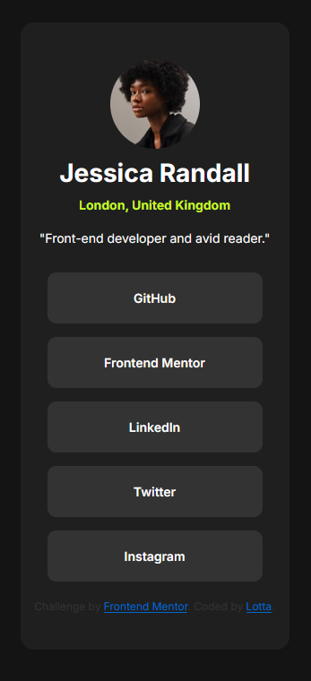

# Frontend Mentor - Social links profile solution

This is a solution to the [Social links profile challenge on Frontend Mentor](https://www.frontendmentor.io/challenges/social-links-profile-UG32l9m6dQ). Frontend Mentor challenges help you improve your coding skills by building realistic projects. 

## Table of contents

- [Overview](#overview)
  - [The challenge](#the-challenge)
  - [Screenshot](#screenshot)
- [My process](#my-process)
  - [Built with](#built-with)
  - [What I learned](#what-i-learned)
  - [Continued development](#continued-development)


## Overview

### The challenge

Users should be able to:

- See hover and focus states for all interactive elements on the page

### Screenshot




## My process

### Built with

- Semantic HTML5 markup
- CSS custom properties
- Flexbox
- Mobile-first workflow

### What I learned

I picked up this challenge because I liked how simple it looked. I tend to take too much time to find the right colours, fonts and layouts - with this challenge, I only did the code. 

I learned a couple new things. 
1. I downloaded the fonts using Google Webfonts Helper. 
2. I used two CSS-files, one for the fonts and one for the rest. I know this is not the best practice, but in this small project I wanted to try the @import-rule.
3. I did the buttons with a-tag and customize the links like a button. This was the biggest new thing I did in this project. I used padding to make the button bigger - or like make the link to a button. 
4. (I also learned how to write this Readme-file and to use Markup to make it even more fancy.)

```html
<section class="links">
    <a href="" class="button">GitHub</a>
    <a href="" class="button">Frontend Mentor</a>
    <a href="" class="button">LinkedIn</a>
    <a href="" class="button">Twitter</a>
    <a href="" class="button">Instagram</a>
  </section>
```
```css
.button {
    font-weight: 600;
    text-decoration: none;
    text-align: center;
    color: var(--color-white);
    background-color: var(--color-grey-700);
    width: 80%;
    padding: 20px;
    border-radius: 10px;
    transition: 150ms ease-in-out;
    transition-property: background-color, color;
}

.button:hover {
    background-color: var(--color-green);
    color: var(--color-grey-900);
}
```

### Continued development

In the future I would like to make something like this, but with a Figma-file. This time I needed to eyeball a lot of margins and sizes. With a Figma-file I could try to make even more precise CSS-code. 


